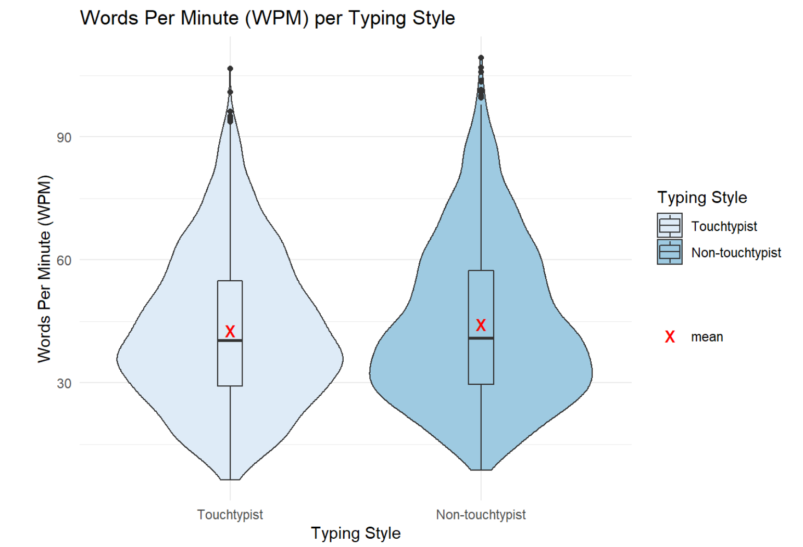
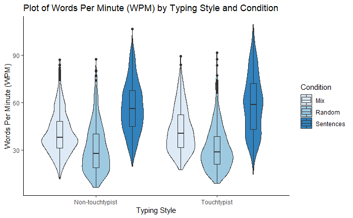
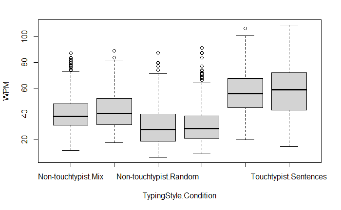

***

### Feedback Summary
In a first step we list all lessons learned that came up during the initial code review phase:

#### Done well-

* Some of the team included helpful theoretical descriptions in the beginning of their project to summarize for the reader what is done in the project.
* The setup of required packages is well handled and brings good reproducibility

```
# define packages
required_packages <- c("tidyverse", "readr", "ggplot2", "stringr")

# install packages when they are not already included
install.packages(setdiff(required_packages, rownames(installed.packages())))  
```

* The notebook makes good use of the R markdown features with marking text as code or using inline R code
  + Marked as code: "...first off, we define a helper function `read_log_files` that will help read in all the different log files."
  + Inline code: "... our data set contains `ncol(data)` columns (*`colnames(data)`*) and `r nrow(data)` rows for `n_distinct(data$user_id)` different users."
* The data wrangling solution created was effective and helpful to include in the final combined project. It consisted of reading all the csv files in the /log directory and parsing *user_id* and *condition* from the filenames of the .csv. And finally joining them together with the *participant_info.csv*
* There were many different visualizations included to enhance the descriptive statistics portion of the assignment.
* The violin plots that are used to visualize the data come in very handy since they include a lot of information with the incorporated box plots as well. Also the mean that is added to these plots makes it very easy to compare the median and mean against each other

<center>

{width=600}

</center>


  
#### Improvement opportunities-

* More explanations and documentation are needed throughout the code. It is important to clearly explain every step undertaken and to add notes to each step and result to aid others in understanding and potentially reproducing the project.There were many calculations and visualizations in the projects that were lacking descriptions.
* Testing assumptions is an important part of the analysis that was not included effectively in all individual projects.
* Exclude unnecessary charts that provide redundant information. The final project should only include charts which contribute new information or insights.
  + For example, both plots below illustrate the results of changing the typing style and condition. They both show a boxplot to demonstrate the interval and median, and they both give indicators of skew with the several dots on top. Therefore, only one of these plots is necessary in the final data analysis.

<center>

{width=400}
{width=400}

</center>

* Overall files could be better organized or broken up into sections to help readers follow along.
* There were a few mistakes or typos present in the files that should be avoided in the final project file by doing a thorough read through for spelling and grammatical errors.
  + For example, the title *Descriptive Statisctics* should be corrected to *Descriptive Statistics*
* The code and text inside the IDE is mostly readable. However the use of R markdown syntax and especially the inline R code that is present in many sections make it hard to read the text and also see the results directly in the source code and run the risk of the descriptions no longer matching the data. Especially with the example below where it is explicitly stated that this first condition was the slowest, which may change if the order of the data changes. This can be solved by doing a final read through to ensure accuracy in all descriptions.

```
Condition 'r colnames(max_wpm_by_condition[1])':
Users who had to type strings in form of 'r colnames(iqr_wpm_by_condition[1])' were the slowest compared to the other conditions. This shows in the lowest 'median' ('r median_wpm_by_condition[[1]]'), 'min'('r min_wpm_by_condition[[1]]') and 'max' ('r max_wpm_by_condition[[1]]') values.

```

***

### Top 3 Lessons Learned

After reviewing all the lessons learned, we summarize with the following top three lessons we learned that we plan to consider for the combined data analysis:

1. **Importance of Documentation:** Without code comments and explanations, it is difficult for readers to interpret the code. Many of us could run the code, however it wasn't always clear what the author was trying to accomplish and what message they wanted to convey with a visualization or function. One way to help users understand the comments quicker is to use `*.rmd` capabilities such as including inline R code and marking parameter names or functions as code.

2. **There is such thing as too many visualizations:** Sometimes it is tempting to display the data in many different ways to demonstrate our skills in graph and chart making while maybe exposing the reader to a new way of looking at the data. However, this can go overboard and is not necessary. In our final project we plan to only include charts that show new information that hasn't been covered by previous tables or plots. This means it is important to choose the best fitting plot that most clearly supports the claim or message we want to convey.

3. **Assumptions should be tested after transformations:** This was a step that wasn't fully clear to our team. After transforming the data and creating many visualizations it seemed natural to jump to finding the best fit model. However, although the p-tests and t-tests cannot always show the big picture or fully describe the data, they are important to give users a potential frame of reference. Therefore, testing assumptions is an important step to include in our final project along with explanations about what the results represent. These tests can be done with the shapiro-wilk test or levene test.
